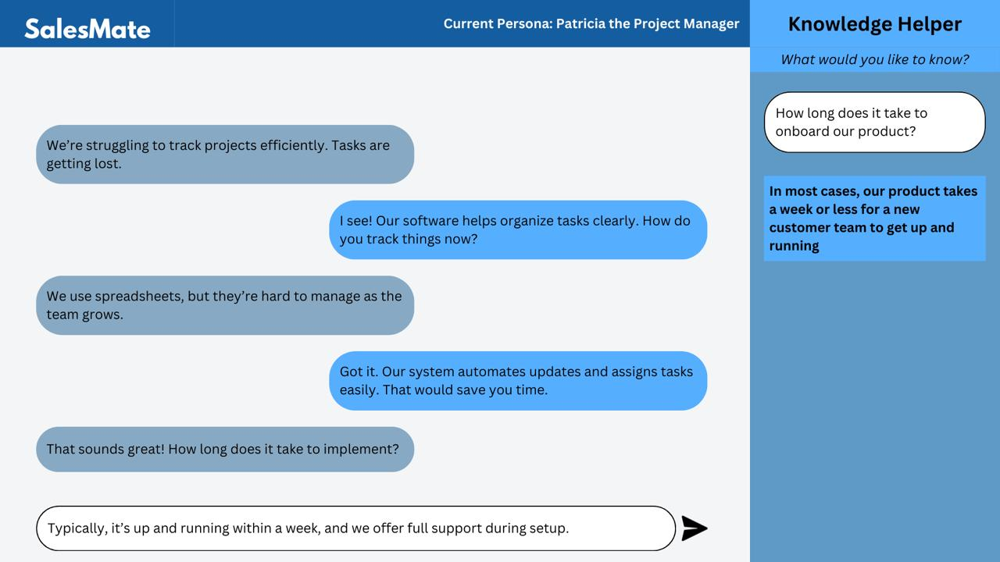
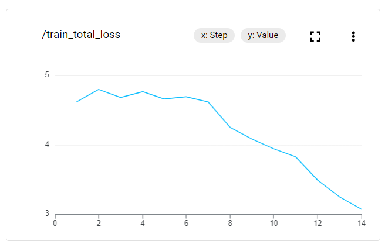
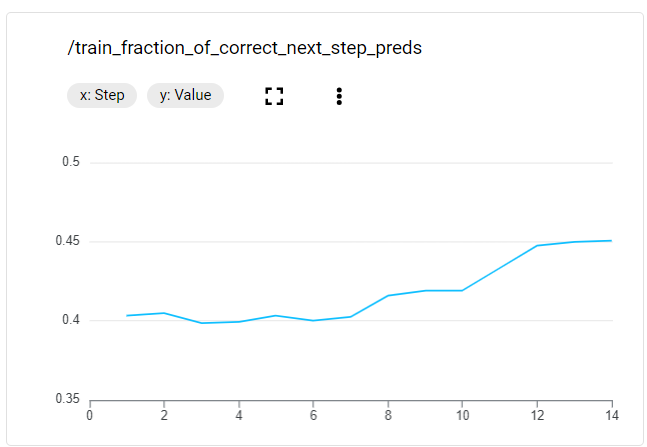

# AC215 - Milestone3 - SalesMate

**Team Members**
Rafael Hoffmann Fallgatter, Rajiv Swamy and Vincent Huang

**Group Name**
SalesMate

**Project**
The objective of this project is to develop a simulation of a sales chat where the AI plays the role of a client and the user must make a sale as a means of practice sales skills. More specifically, it will simulate a situation where the user is offering financial services. This was chosen since we have a dataset of past calls in this situation.
The app will be a chat interface where the AI answers using a model fine-tuned in real sales conversations. Moreover, the app will also have a copilot, which gives recommendation to the seller of how to answer to technical questions by having access to a knowledge base of pdfs of finance documents using RAG.

## Milestone3 Updates##
We made extensive progress in extending the CLI processes from Milestone2 into a full-stack web application. Here are the big updates for the work in Milestone3:
- Added functionality to the rag_copilot_pipeline so that it can communicate insights through a HTTP interface with FastAPI
- Created a front-end-react container that enables users to interact with our application from their browser, both the customer simulator and copilot are accessible with our frontend protoype.
- Created a primary backend api container (api_service) that is meant to communicate with the rag_copilot_pipeline and make calls to the LLM model (in this case, a finetuned Gemini endpoint). 
- Added both local and server side testing suite (read more in our testing documentation in the reports folder)
- Container Orchestration: modified the docker compose file to launch and run the containers needed for the web app (chromadb, rag_copilot_pipeline, api_service, and frontend-react).
- Documentation: Inside the reports folder there is the testing documentation as well as the diagrams from the app. Inside each of the containers folders we have further detailed the READMEs
- Data: the fintuning pipeline reads from and saves to GCP bucket, but we also added a sample of input and output data from the data processing pipeline in the data folder of this repo as a reference.

### Overall architecture

1. Fine-tuning container
This container is used solely at the time of training the model. It process the required data, trains a VertexAI model and host it on GCP. For more info on it see src/finetuning_pipeline/README

2. Web application - backend
This is a combination of three containers that are orchestrated by the docker-compose.yml file located in the src/ folder. Those containers are:
- api_service container that sends all information to the frontend. It sends and receivs data from the LLM model hosted on GCP, that simulates a customer, as well as the rag container, that serves as a copilot for the seller
- rag_copilot_pipeline that serves as copilot for the seller, answering all questions they might have
- chromadb that hosts a vector database with the knowledge base of the copilot
More info on src/api_service/README and src/rag_copilot_pipeline/README.

3. Web application - frontend
Frontend built on react that connects to the api_service backend container. More info on src/frontend-react/README.

### Directions to run fine-tuning pipeline ##
1. ``cd src``. Ensure that you have placed llm-service-account.json keys in the ``./finetuning_pipeline/secrets`` directory 
2. ``source docker-shell.sh "pipenv run python cli.py --process_data --data_path ac215_salesmate/data/extract_calls_pt.csv --train"``, this will process data, save it in a GCP bucket, train a model using VertexAI and host it on GCP. 

### Directions to run web app (spin up full-stack containers) ##
1. ``cd src``. Ensure that you have placed gc-key.json keys in the ``./api_service/secrets`` directory and ``./rag_copilot_pipeline/secrets`` directory, follow the naming in the docker compose file.
2. ``source docker-shell.sh``, this will launch the chromadb, rag_copilot_pipeline, api_service, and frontend-react containers.
3. If you'd like logs for the containers, run ``docker compose logs -f``
4. To go to the web app, navigate to ``http://localhost:3000`` on your browser.

## Milestone2 ##

In this milestone, we have developed a first version of all the main components of the application, but not yet cconnecting them in single a application. The next step is to make those connections and improve performance of each component. 

### Data ###
We got access to 1235 sales calls, which we used to finetune the model. Those calls were made by a Brazilian company and therefore were all in Portuguese. Therefore the first step of the data processing was 

**Data Pipeline**
1. The code receives a csv with the transcripts of the calls, were each row is an entire call. It then uses Google Translate to translate the transcripts from portuguese to english keeping the same data format.

2. Since at this stage we are fine-tuning Gemini, we must put the data in the format it expects, that is, a jsol, were each row is a question and an answer, instead of an entire call. After this procedure, we have a jsol with over 10k rows. This is devidided into a train and a test set, were the test set has 250 cases, and the test set has the rest. 

See the data-translation container for more details of the translation dataprocessing pipeline.

**Data Versioning**

We are in the process of transitioning our cloud provider from GCP to AWS [we are still waiting for AWS credits for this as we are stuck on the free tier]. We aim to utilize Amazon Delta Lake for a naitively versioned data store as per the recommendation of our TF Mentor. Otherwise we will utilize an S3 bucket with DVC. 

### User interface ###

The frontend will look as in the following image, were the user has access to the chat with the AI, as well as the copilot.

For this milestone, we are simulating the chat and the copilot separately in the local CLIs. 

**Chat**

The user interacts with the AI via a chat, as in a real sales conversation. The chat code makes an API call to a container in an EC2 in AWS that has pre-trained mini-llama model and generates the response. In the future, the response will be generated by a pre-trained model. 

**Copilot**

The goal of this module is to help the user by getting information from technical pdf documents using RAG. The process is as follows:

1. Add pdfs to local folder and generate a vector database

2. Receive the questions generated by the AI-seller and use Gemini to determine whether it´s necessary to search for information in the knowledge base. 

3. If it is necessary to search for information, it summarizes the questions, vectorizes it and searches for information in the database

4. Answers question with this information

### Model fine-tuning ###

This is a container responsible for fine-tuning an LLM in past calls data generated by the data processing pipeline.

For this milestone, we only trained with a sample of 1k rows, but in the future we will train with entire data. Moreover, we used Vertex AI to fine-tune gemini, since we havent yet received the AWS credits. When we receive it, we will use hugging face to fine tune other models on an EC2 and serve the model using Sage Maker. 

We trained the gemini-1.5-flash-002, for 3 epochs and adapter size of 4. Following are some training metrics:

## Running the code

Instructions for running each of the parts of the code is contained in the README inside the folder of each component in src:
1. chat-container -> container were you can talk to the llm located in llm-backend-ec2 via a chat interface
2. data-processing-pipeline -> container to translate and process the data used for fine-tuning
3. finetuning-pipeline -> container to fine-tune Gemini using the data generated in data-processing-pipeline
4. llm-backend-pipeline -> code used in EC2 to set up a server with a llama model
5. rag-copilot-pipeline -> container setting up an infrascturucture to run RAG on pdfs and give answers rrecommendation

Right now each part must be run independently, but we have added a docker-compose in the src folder that today is running only the rag-copilot-pipeline but in the future will run the end-to-end process. 
