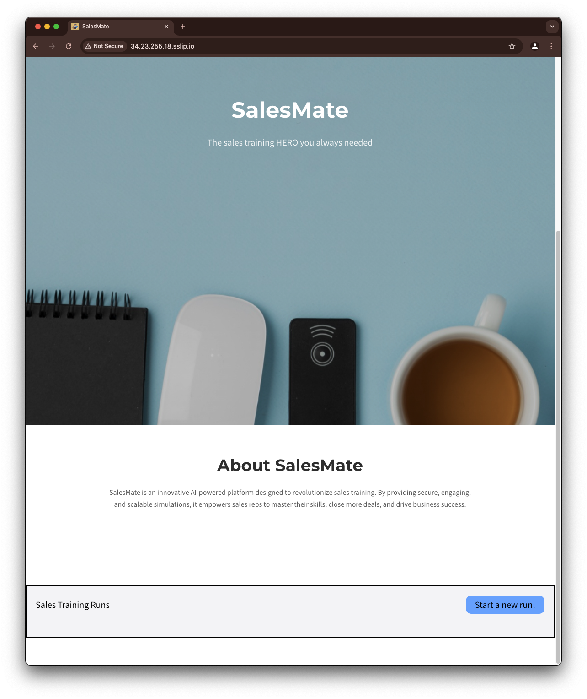
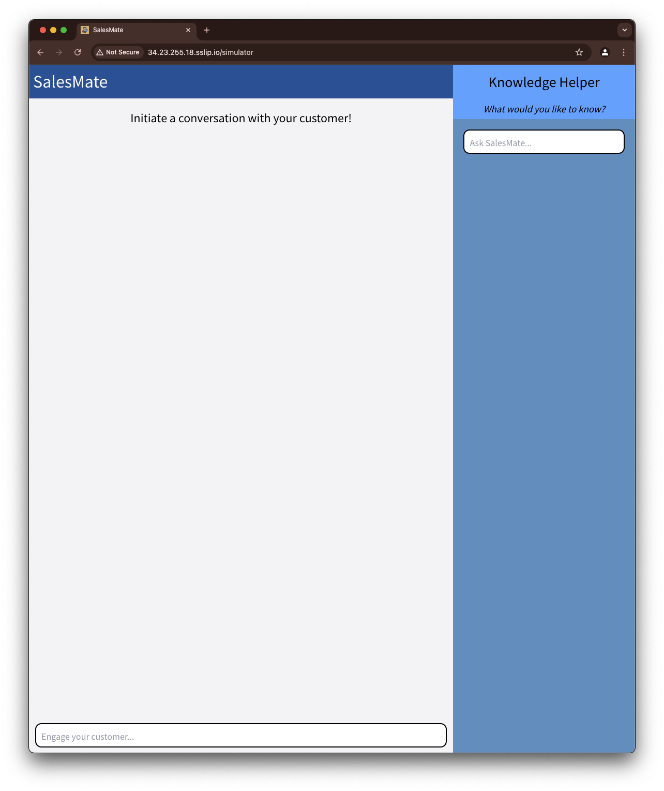
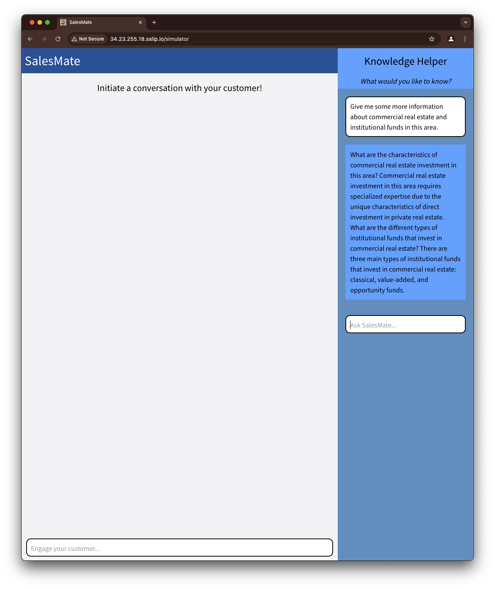
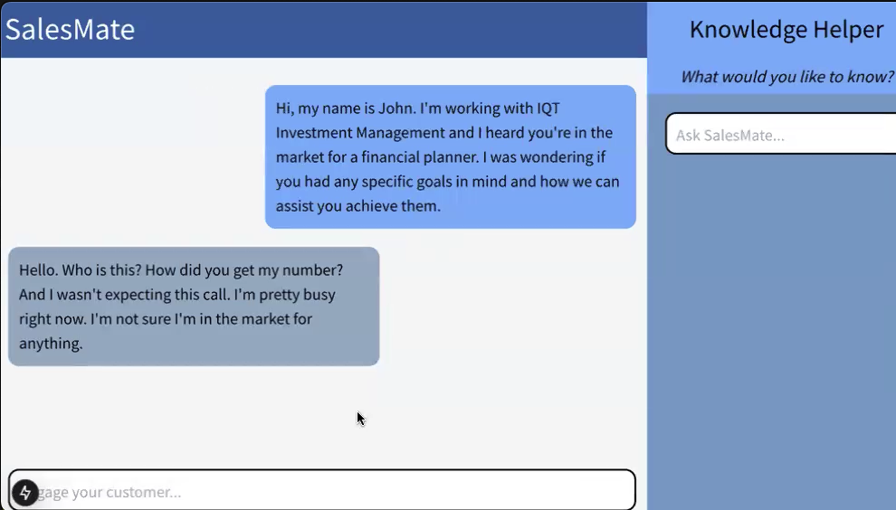

# AC215 - SalesMate

This project was developed as part of the final project for Harvard’s AC215 Fall 2024 course. It aims to provide an AI-driven sales training tool that simulates real customer interactions and offers a sales copilot to assist sales representatives. The customer simulation was done by fine tuning a Large Language Model (LLM) that simulates real customer interactions. The sales copilot provides answers to user queries using a knowledge base accessed via Retrieval-Augmented Generation (RAG). Users can interact with the app via a web interface.

- **Medium article**: [AI sales simulator and copilot for sales training](https://medium.com/@rafaelhfallgatter/ai-sales-simulator-and-copilot-for-sales-training-on-gcp-a161f85148ed)
- **Video**: [Project Presentation](https://youtu.be/LiBtzDHXrmY)
- **Team**: Rafael Hoffmann, Vincent Huang, Rajiv Swamy

## Preview of application

## Architecture

On a high level, the architecture can be separated into two main parts: the Application Layer and the Model Training Layer. The Application Layer is a combination of containers orchestrated by a Kubernetes cluster that comprises everything required for the web application to run. It contains a) the Application module, with the front and backend of the application; b) the Sales Copilot Module, implementing the RAG on the Knowledge Base and c) the Client Simulator Module, which generates the responses of the AI by connecting to the fine tuned model. The Model Training Layer contains a pipeline that is run only when there is a change on data or on the model architecture and is responsible for processing the data, training the model and deploying the model.

The system was built on GCP, and its technical architecture can be seen in the following image.

## Folders organization

Below is information on how the code is organized. For more information on each part and how to run it, go to the README inside the folder of interest.

### Model Training Layer

All code from the model training pipeline is in:

- src/finetuning_pipeline

It contains both the Dockerfile for the container used as well as the code for processign the data, training the model and deploying the model. The code is run on a Cloud Run job.

More instructions on how to run the code can be found in the README inside src/finetuning_pipeline.

### Application Layer

The code for the application is contained on:

- src/frontend_react: the frontend container
- src/api_service: the backend container
- src/rag_copilot_pipeline: the copilot container

Those containers are orchestrated by the src/docker-compose.yml. To run the frontend/backend applications locally, add the required secrets inside each of the container and run src/docker-shell.sh.

More information can be found in the README of each container.

### Usage Details

#### Landing Page

The landing page is the first page that users will see when they enter the application. It contains a short description of the application and a button to start a new run.

#### Simulator Page (New Run)

The simulator page is the core of the sales training experience. It features:
- **Left Panel: Training Simulator Chat**
    - Users can engage in a simulated conversation with a "customer".
    - Conversations are persisted and available for review on the home page after leaving.
- **Right Panel: Sales Copilot**
    - Users can query the sales copilot for answers to their questions.
    - The sales copilot uses a knowledge base to provide answers.

Click on the SalesMate logo in the top left to return to the home page.

#### Sales Copilot Example

#### Chat Example

### Deployment

The deploy of the application is done using an Ansible playbook contained in:

- src/deployment_gcp

Please take a look at the Readme in the deployment_gcp folder for more information on how to spin up the deployment container and execute the Ansible playbooks for deployment on GCP/Kubernetes.

### CI/CD

We hvae set up a CI/CD pipeline in github, which is set up inside:

- .github/workflows/CI_docker.yml

See the testing documentation in the `reports/testing_documentation/testing.md` file for more information.

### Testing

Please navigate to `reports/testing_documentation/testing.md` to learn more about the testing pipeline behind Sales Mate. Here you can see screenshots of the github actions workflow as well.

### Known Issues and Limitations
- Still working out an issue where the Github action for deployment runs out of memory due to limitations in the memory/docker on the default Github action runner.